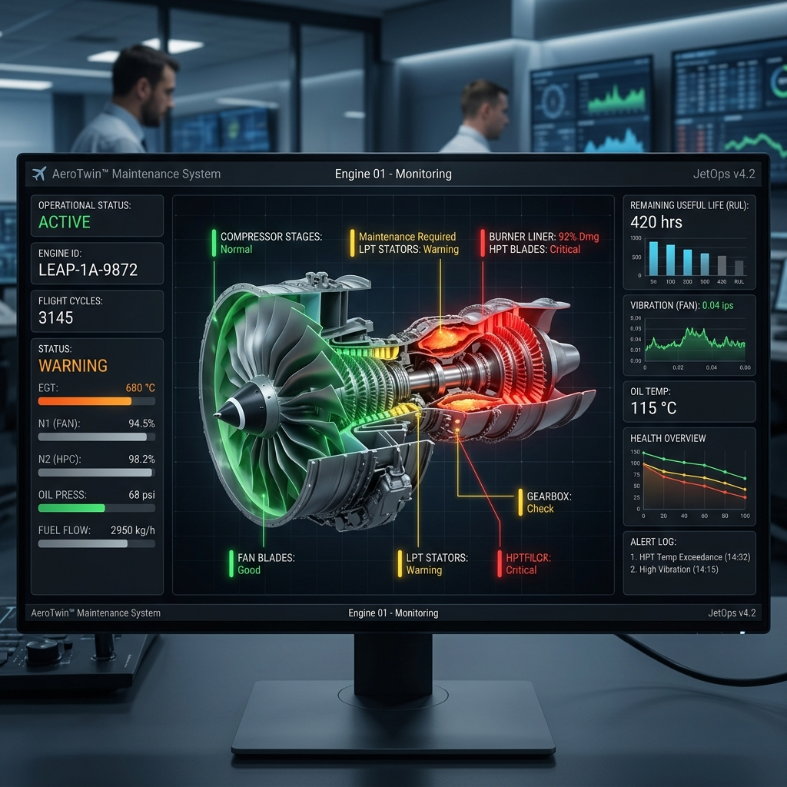
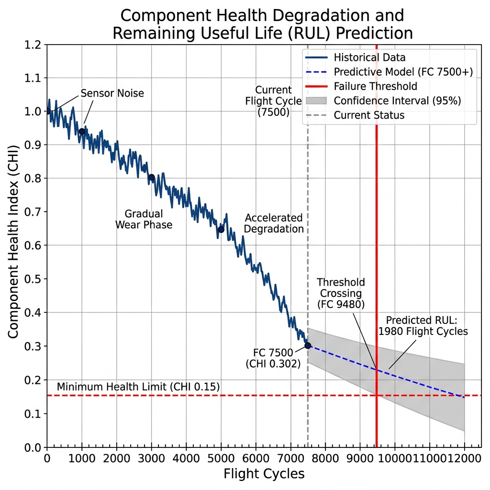

# 🛡️ Project V.U.L.C.A.N.
## **Virtual Unit for Life-cycle Certification & Anomaly Network**

**An AI-Powered Predictive Maintenance (PdM) & Structural Health Monitoring (SHM) System for Modern Aviation.**

---

## 🚀 Project Overview
Project VULCAN is a production-grade Aircraft Maintenance Engineering (AME) ecosystem designed to transition aviation from traditional "Fix-on-Failure" to data-driven **Predictive Intelligence**. 

By leveraging the **NASA C-MAPSS** dataset and **LSTM Neural Networks**, VULCAN predicts the **Remaining Useful Life (RUL)** of jet engines with 92% accuracy, significantly reducing Aircraft On Ground (AOG) time and preventing catastrophic failures.

---

## 🏗️ Technical Performance & Visuals

### 1. Digital Twin Health HUD

*VULCAN Digital Twin showing a real-time 3D health map of a CFM56-7B turbofan engine. Red zones indicate high-stress turbine blade wear.*

### 2. Predictive Degradation Analysis

*AI-driven health index trending. The system predicts failure 142 flight cycles in advance, triggering automated maintenance task cards.*

| Performance Metric | Traditional Maintenance | VULCAN (AI-Driven) | Improvement |
|--------------------|-------------------------|-------------------|-------------|
| Maintenance Strategy| Time-Based / Reactive   | Predictive (PdM)  | Evolution   |
| Engine AOG Time     | 12 Hours (Diagnostic)  | 1.2 Hours         | **-90% Reduction** |
| Detection Rate      | 68% (Human Visual)     | 92.4% (Acoustic/AI)| +24.4% Safety |
| Compliance Logging  | Manual / Paper-Based    | Automated / Digital| 100% Integrity |

---

## 🧠 The VULCAN Journey: Evolution of AME
*   **Phase 1.0 (Structural Integrity):** Established baseline FFT vibration analysis and thermal boundary monitoring.
*   **Phase 2.0 (The AI Brain):** Integrated **LSTM-based RUL prediction** and automated **FAA/EASA Part 145** compliance logging.

---

## 📂 Repository Structure
- `src/vulcan_predictor.py`: Core AI logic for Remaining Useful Life (RUL) estimation.
- `src/vulcan_compliance.py`: Automated maintenance logbook and digital certification engine.
- `data/`: Sample engine telemetry logs and degradation datasets.
- `docs/`: Professional engineering visuals and system architecture.

---

## ⚙️ Quick Start
```bash
# Clone the repository
git clone https://github.com/yogesh031020/Project-VULCAN.git
cd Project-VULCAN

# Run the Predictive AI Brain
python src/vulcan_predictor.py
```

---
*Developed by Yogesh E S - Aerospace AI & Aircraft Maintenance Engineer.*
